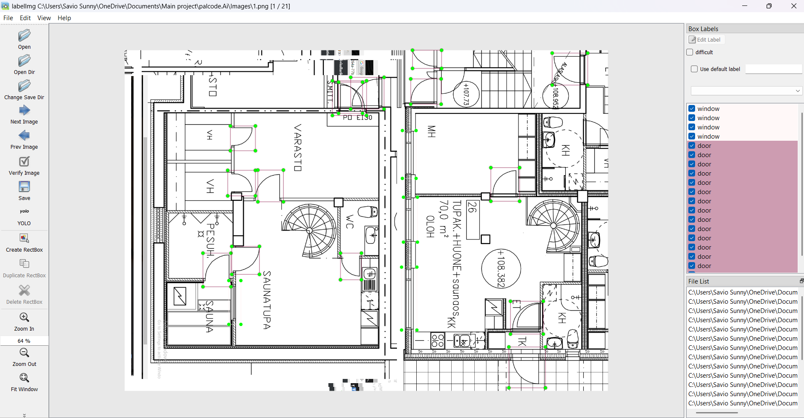
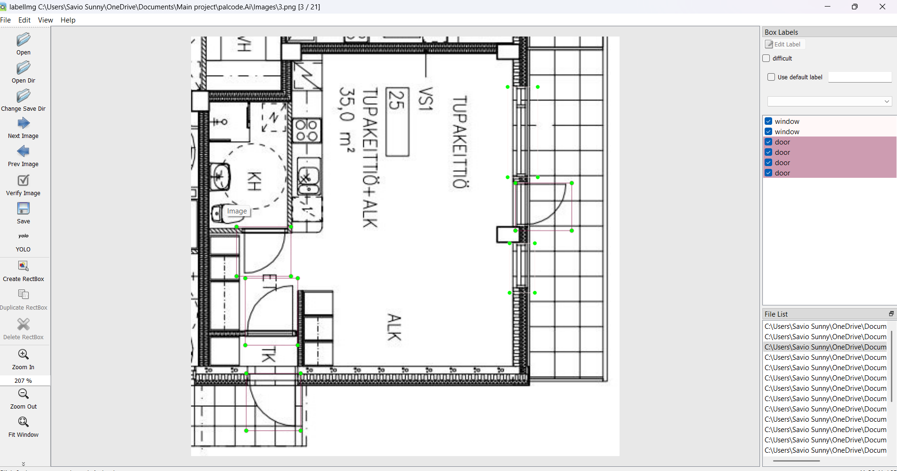
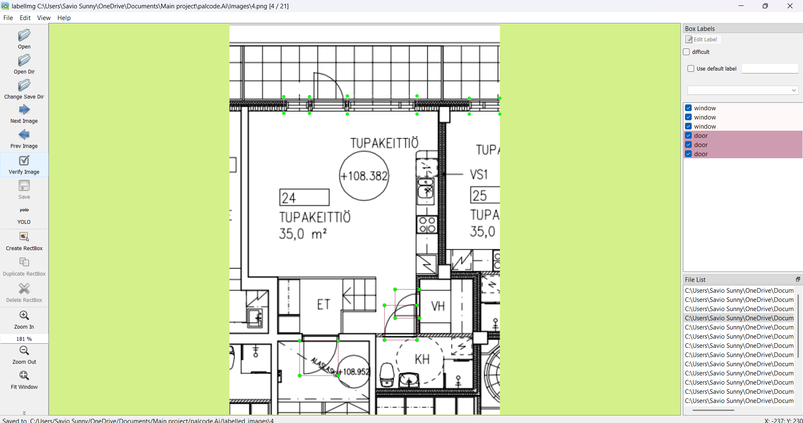
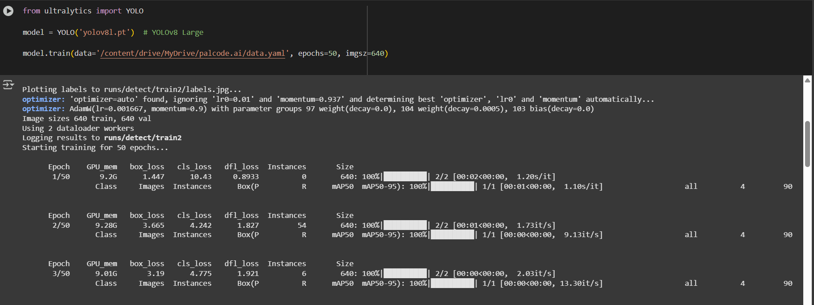
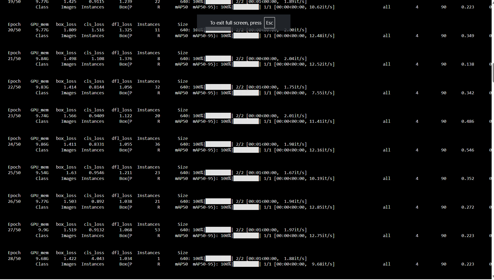
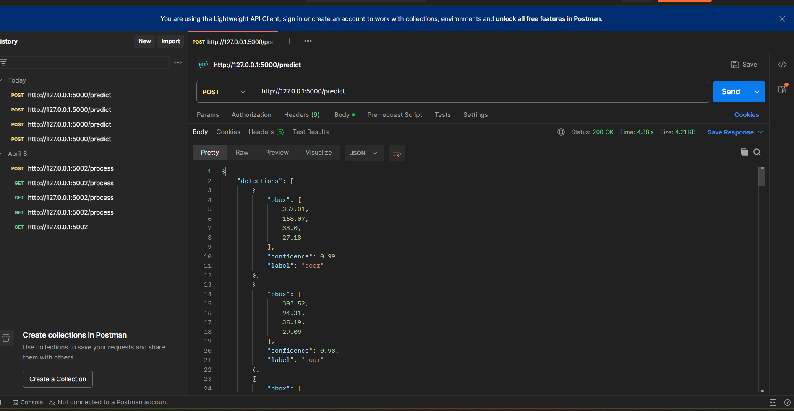

# 🪟 Detection of Windows and Doors using YOLOv8 + Flask API

This project demonstrates how to detect **windows** and **doors** in building images using the **YOLOv8n** model and serve the results via a simple **Flask API**.

---

## 📁 Project Structure

| File/Folder | Description |
|-------------|-------------|
| `images/` | Contains raw images used for training. It includes two folders: `test/` (80%) and `val/` (20%). No bounding boxes are drawn in these images. |
| `labels/` | Contains corresponding label files (bounding box coordinates) for the images, organized into `test/` and `val/`. |
| `data.yaml` | Configuration file for YOLO training, including path info and class mapping. Class `0` is **Window**, class `1` is **Door**. |
| `classes.txt` | Defines the classes used in training: `window` and `door`. |
| `runs/detect/` | Contains the trained model and output files. Look inside for `best.pt`, the final trained YOLOv8l model. |
| `screenshots/` | Contains various screenshots taken during:<br>- Manual labelling process<br>- Training using Google Colab with TPUv4<br>- Testing the API with Postman |
| `app.py` | Flask server that loads the model and returns detections when images are passed to the `/render` endpoint. |
| `requirements.txt` | Required dependencies for the API to run. |

---

## 🧠 Model Training Info

- Trained using [YOLOv8 Nano](https://github.com/ultralytics/ultralytics) on Google Colab with **TPUv4**.
- 2-class detection problem: `Window` and `Door`.
- Labelled using manual annotation tools.
- Final model weights saved as `best.pt`.

---

## 🚀 How to Run This Project

### 1. Clone the Repository

```bash
git clone https://github.com/S48avio/Detection-of-Windows-and-Doors-using-Yolov8.git
cd Detection-of-Windows-and-Doors-using-Yolov8
```

### 2. Install Dependencies

```bash
pip install -r requirements.txt
```

### 3. Start the Flask API

```bash
python app.py
```

### 4. Use Postman to Test

Send a POST request to:

```
http://127.0.0.1:5000/predict
```

With:
- **Body type:** form-data
- **Key:** `image` (type: file)
- **Value:** Upload any test image

You will receive a JSON output with the prediction results (bounding box coordinates, confidence score, and class names) 

---

## 🖼 Sample Screenshots

### 🔧 Manual Labelling  




### 🏋️‍♂️ Training with Colab TPUv4  



### 🧪 Testing with Postman  



---

## 🤖 Model Performance & Notes

- Achieved good results on a small custom dataset.
- Extendable to more classes and large datasets.
- Easy to integrate into larger systems for smart city or architectural automation.

---

## 🔗 Related Repositories

You can view the full training notebook and methodology here: [YOLOv8 Training Repo](https://github.com/S48avio/Training_YOLOV8N)

---

## 📬 Contact

For questions or collaboration: saviosunny48@gmail.com
